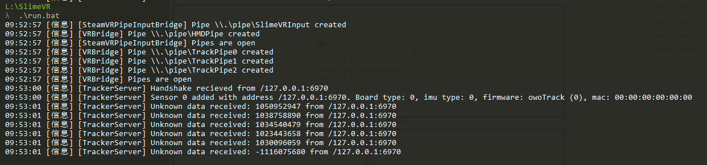
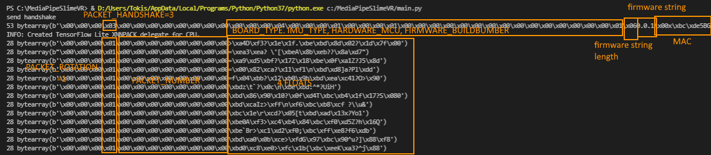

Hi, 

I'm trying to make a program that implement a SlimeVR tracker through CV methods.

I'm planning to use webcam to estimate human body's pose (with MediaPipe),  and then send data to SlimeVR Server through UDP.

Although, I've made it able to successfully handshake, but now I encountered issues when sending Quaternion with my "translation" from C++ [udpclient.cpp](https://github.com/SlimeVR/SlimeVR-Tracker-ESP/blob/main/src/udpclient.cpp)(in SlimeVR-Tracker-ESP) to Python [UdpClient.py](https://github.com/TkskKurumi/SlimeVR-Tracker-Mediapipe/blob/main/UdpClient.py)(my implementation) .

SlimeVR Server reports `[TrackerServer] Unknown data received: ...`, `...` is for the first float I send. Seems that the server ignored the PACKET_TYPE and PACKET_NUMBER bytes. I tried to pad bytes to make the PACKET_TYPE aligned same as the first float byte after handshake and doesn't work.

(I tried to replace float bytes with cognizable integers and found out that the PACKET_TYPE server receives is the first integer(float) .)

